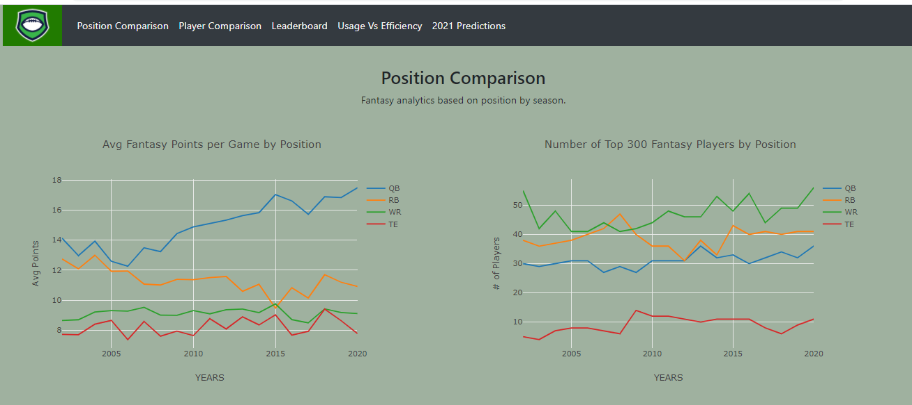
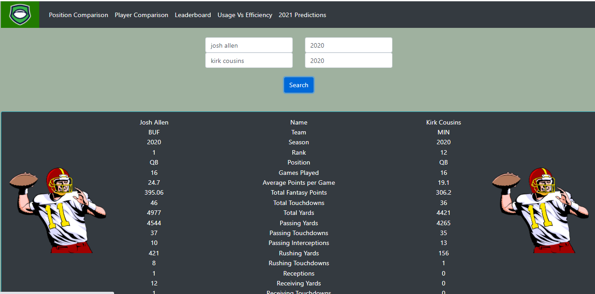
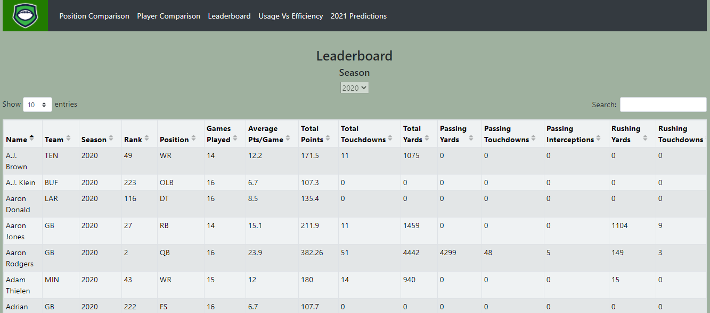
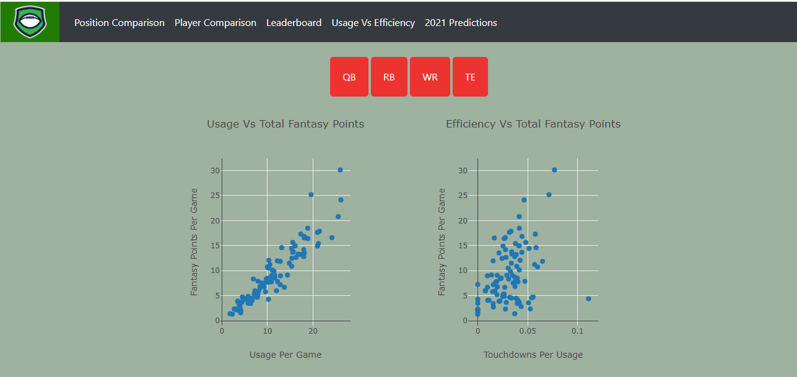
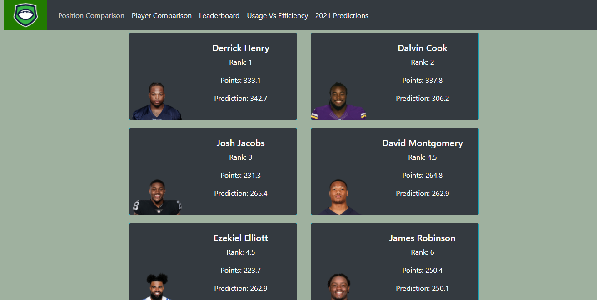

# fantasy-football-analyzer

https://fantasy-football-analysis.herokuapp.com/

- - -

ARE YOU READY FOR SOME FOOTBALL???

- - -

Fantasy football is a great way to compete against your friends and family to see who can draft and manage the best nfl virtual football team.

In most cases, the winner of fantasy football leagues will take home cash prizes! So this year, let us help you win!

The fantasy football analyzer is a great way to compare position performances, player performances, and make predictions for the upcoming season. 

All the data used for this tool comes from the below sites.  After putting our blood, sweat, and tears into scraping, transforming, and loading various dataframes into our AWS database, we used javascript, html, css, and flask to create this interactive tool as a "cheat sheet" for your next fantasy football draft party. 

* https://thehuddle.com/
* https://sportsdata.io/?_vsrefdom=googleppc&gclid=CjwKCAjwgZuDBhBTEiwAXNofRI5R7rF9T6qdrHlEA1qnV9YHbHb18UmCYVEnlgy4w1RnKJKAWiCXEhoC8ngQAvD_BwE
* https://www.pro-football-reference.com/

- - -

Take a look!

https://fantasy-football-analysis.herokuapp.com/

- - -

- - -